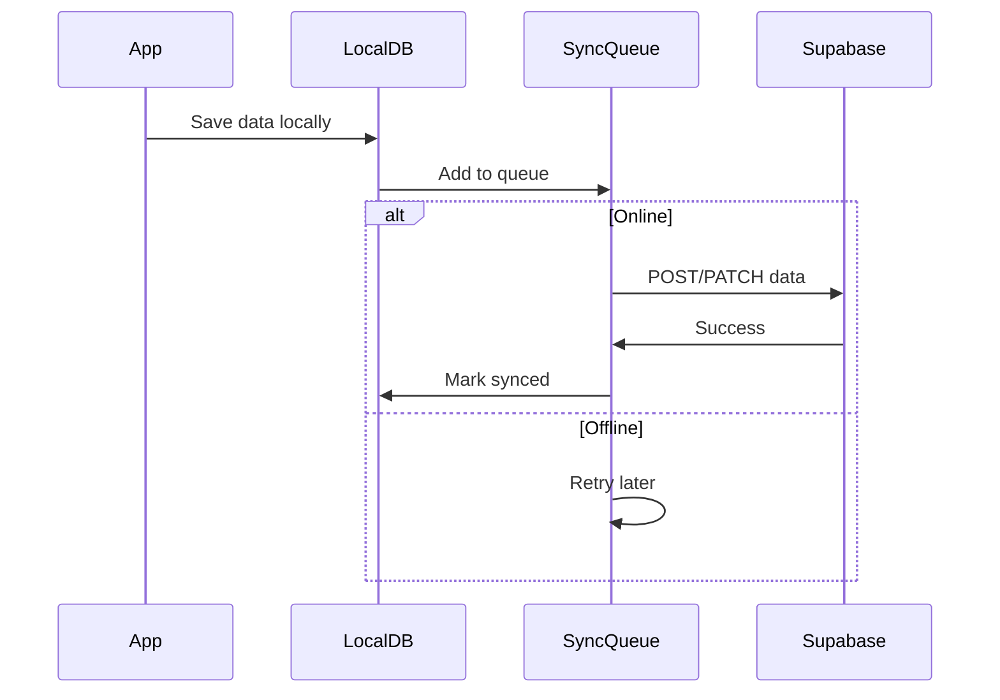

# MotivAid - API Design

## Overview

MotivAid uses **Supabase** as the backend, leveraging its auto-generated REST API and real-time subscriptions.

---

## Authentication API

### Login
```http
POST /auth/v1/token?grant_type=password
Content-Type: application/json

{
  "email": "midwife@facility.com",
  "password": "securePassword123"
}
```

**Response:**
```json
{
  "access_token": "eyJ...",
  "refresh_token": "eyJ...",
  "expires_in": 3600,
  "user": {
    "id": "uuid",
    "email": "midwife@facility.com",
    "role": "midwife"
  }
}
```

### Logout
```http
POST /auth/v1/logout
Authorization: Bearer <access_token>
```

### Refresh Token
```http
POST /auth/v1/token?grant_type=refresh_token
Content-Type: application/json

{
  "refresh_token": "eyJ..."
}
```

---

## Data API (REST)

All data endpoints follow the Supabase PostgREST pattern.

### Base URL
```
https://<project-ref>.supabase.co/rest/v1
```

### Headers
```http
apikey: <anon-key>
Authorization: Bearer <access_token>
Content-Type: application/json
Prefer: return=representation
```

---

## Facilities

### Get User's Facility
```http
GET /facilities?id=eq.<facility_id>&select=*
```

### List All Facilities (Admin Only)
```http
GET /facilities?select=*&is_active=eq.true
```

---

## Maternal Profiles

### Create Profile
```http
POST /maternal_profiles
Content-Type: application/json

{
  "facility_id": "uuid",
  "age": 28,
  "parity": 2,
  "has_anemia": false,
  "has_pph_history": true,
  "has_multiple_pregnancy": false
}
```

### Get Profile
```http
GET /maternal_profiles?id=eq.<profile_id>&select=*
```

### Calculate Risk Level (Edge Function)
```http
POST /functions/v1/calculate-risk
Content-Type: application/json

{
  "age": 28,
  "parity": 2,
  "has_anemia": true,
  "has_pph_history": true,
  "has_multiple_pregnancy": false
}
```

**Response:**
```json
{
  "risk_level": "high",
  "risk_factors": ["anemia", "pph_history"],
  "recommendations": [
    "Prepare IV access",
    "Have uterotonics ready",
    "Increase monitoring frequency"
  ]
}
```

---

## PPH Cases

### Create Case
```http
POST /pph_cases
Content-Type: application/json

{
  "facility_id": "uuid",
  "maternal_profile_id": "uuid",
  "midwife_id": "uuid",
  "delivery_time": "2026-01-26T10:30:00Z",
  "status": "active"
}
```

### Update Case
```http
PATCH /pph_cases?id=eq.<case_id>
Content-Type: application/json

{
  "blood_loss_ml": 750,
  "shock_index": 1.2,
  "status": "active"
}
```

### Get Case with Relations
```http
GET /pph_cases?id=eq.<case_id>&select=*,
  maternal_profile:maternal_profiles(*),
  midwife:users(full_name,phone),
  interventions(*),
  vital_signs(*)
```

### List Facility Cases
```http
GET /pph_cases?facility_id=eq.<facility_id>&select=*&order=started_at.desc&limit=20
```

### Close Case
```http
PATCH /pph_cases?id=eq.<case_id>
Content-Type: application/json

{
  "status": "resolved",
  "outcome": "resolved",
  "ended_at": "2026-01-26T12:00:00Z"
}
```

---

## Interventions

### Log Intervention
```http
POST /interventions
Content-Type: application/json

{
  "pph_case_id": "uuid",
  "type": "oxytocin",
  "name": "Oxytocin 10 IU IM",
  "performed_by": "uuid",
  "dosage": "10 IU",
  "route": "IM",
  "is_completed": true
}
```

### Get Case Interventions
```http
GET /interventions?pph_case_id=eq.<case_id>&order=performed_at.asc
```

---

## Vital Signs

### Record Vital Signs
```http
POST /vital_signs
Content-Type: application/json

{
  "pph_case_id": "uuid",
  "heart_rate": 110,
  "systolic_bp": 90,
  "diastolic_bp": 60,
  "shock_index": 1.22,
  "recorded_by": "uuid"
}
```

### Get Case Vital Signs History
```http
GET /vital_signs?pph_case_id=eq.<case_id>&order=recorded_at.asc
```

---

## Training

### Start Training Session
```http
POST /training_sessions
Content-Type: application/json

{
  "user_id": "uuid",
  "scenario_id": "scenario_001"
}
```

### Complete Session
```http
PATCH /training_sessions?id=eq.<session_id>
Content-Type: application/json

{
  "completed_at": "2026-01-26T11:00:00Z",
  "score": 85.5,
  "time_taken_seconds": 1200,
  "is_passed": true
}
```

### Record Quiz Answer
```http
POST /quiz_results
Content-Type: application/json

{
  "training_session_id": "uuid",
  "question_id": "q_001",
  "answer_given": "B",
  "is_correct": true,
  "time_taken_seconds": 30
}
```

### Get User Training History
```http
GET /training_sessions?user_id=eq.<user_id>&select=*,quiz_results(*)&order=started_at.desc
```

---

## Real-time Subscriptions

### Subscribe to Case Updates
```dart
supabase
  .channel('pph_case_updates')
  .onPostgresChanges(
    event: PostgresChangeEvent.update,
    schema: 'public',
    table: 'pph_cases',
    filter: PostgresChangeFilter(
      type: PostgresChangeFilterType.eq,
      column: 'id',
      value: caseId,
    ),
    callback: (payload) {
      // Handle real-time update
    },
  )
  .subscribe();
```

---

## Edge Functions

### 1. calculate-risk
Calculates PPH risk level based on maternal factors.

### 2. generate-case-report
Generates PDF case report for audits.

### 3. send-escalation-alert
Sends SMS/push notifications for emergencies.

### 4. sync-offline-data
Handles conflict resolution for offline sync.

---

## Error Responses

| Status | Description |
|--------|-------------|
| 400 | Bad request - validation error |
| 401 | Unauthorized - invalid/expired token |
| 403 | Forbidden - RLS policy violation |
| 404 | Not found |
| 409 | Conflict - duplicate entry |
| 500 | Server error |

**Error Format:**
```json
{
  "code": "PGRST116",
  "message": "The result contains 0 rows",
  "details": null,
  "hint": null
}
```

---

## Offline Sync Strategy



### Conflict Resolution
1. **Last-write-wins** for simple fields
2. **Merge** for array fields (interventions)
3. **Server-priority** for critical fields (status)
