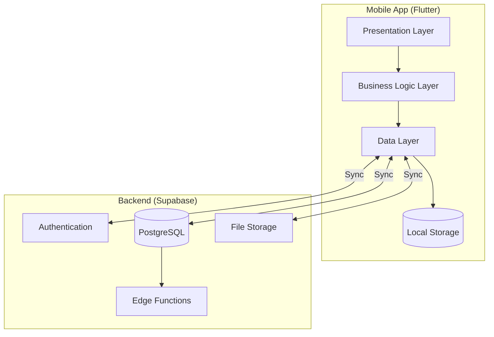
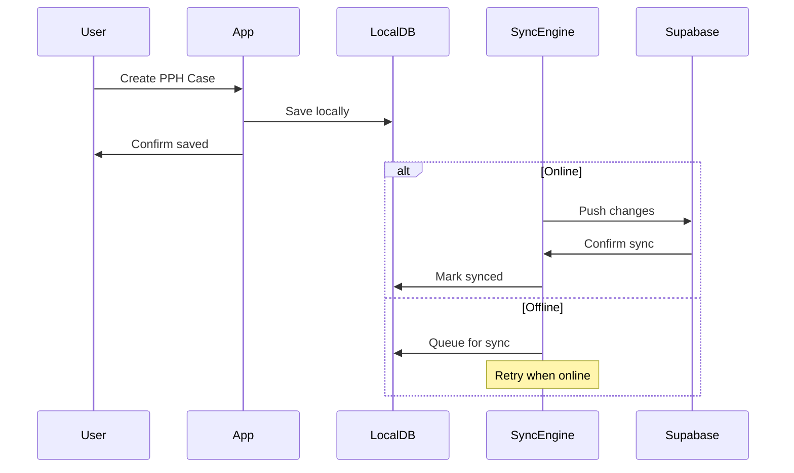

# MotivAid - System Architecture

## Overview

MotivAid uses a **clean architecture** pattern with offline-first design, ensuring the app works reliably in low-connectivity environments.

---

## High-Level Architecture



---

## Layer Breakdown

### 1. Presentation Layer
| Component | Responsibility |
|-----------|----------------|
| Screens | Full-page views (Login, Dashboard, Clinical Mode) |
| Widgets | Reusable UI components |
| Controllers | Screen-level state management |

### 2. Business Logic Layer
| Component | Responsibility |
|-----------|----------------|
| Use Cases | Single-responsibility business operations |
| Services | Cross-cutting concerns (sync, notifications) |
| Validators | Input validation and clinical rules |

### 3. Data Layer
| Component | Responsibility |
|-----------|----------------|
| Repositories | Abstract data source access |
| Local Sources | SQLite/Hive operations |
| Remote Sources | Supabase API calls |
| Sync Engine | Offline/online synchronization |

---

## Offline-First Architecture



---

## State Management (Riverpod)

```
┌─────────────────────────────────────────────┐
│              Providers Hierarchy             │
├─────────────────────────────────────────────┤
│  AuthProvider        → User authentication  │
│  ├── UserProvider    → Current user data    │
│  └── RoleProvider    → Role permissions     │
│                                              │
│  ClinicalProvider    → Clinical mode state  │
│  ├── TimerProvider   → PPH monitoring timer │
│  ├── ChecklistProvider → E-MOTIVE steps    │
│  └── AlertProvider   → Clinical alerts      │
│                                              │
│  SyncProvider        → Sync status          │
│  └── QueueProvider   → Pending operations   │
└─────────────────────────────────────────────┘
```

---

## Security Architecture

| Layer | Security Measure |
|-------|------------------|
| Transport | TLS 1.3 (HTTPS) |
| Storage | AES-256 encryption |
| Authentication | Supabase Auth + JWT |
| Authorization | Row-Level Security (RLS) |
| Data Isolation | Facility-based segmentation |

### RLS Policy Example
```sql
-- Users can only see cases from their facility
CREATE POLICY "Facility isolation" ON pph_cases
  FOR SELECT USING (
    facility_id = (
      SELECT facility_id FROM users WHERE id = auth.uid()
    )
  );
```

---

## Directory Structure

```
lib/
├── main.dart
├── app.dart
│
├── core/                    # Core utilities
│   ├── config/              # App configuration
│   ├── constants/           # App constants
│   ├── errors/              # Error handling
│   ├── network/             # Network utilities
│   ├── storage/             # Local storage
│   ├── theme/               # App theming
│   └── utils/               # Helpers
│
├── features/                # Feature modules
│   ├── auth/                # Authentication
│   ├── dashboard/           # Main dashboard
│   ├── clinical/            # Clinical mode
│   ├── training/            # Training mode
│   ├── reports/             # Reports & audits
│   └── settings/            # App settings
│
├── shared/                  # Shared components
│   ├── models/              # Data models
│   ├── widgets/             # Reusable widgets
│   ├── providers/           # Global providers
│   └── services/            # Global services
│
└── l10n/                    # Localization (future)
```

---

## Technology Decisions

| Decision | Choice | Rationale |
|----------|--------|-----------|
| Framework | Flutter | Cross-platform, single codebase |
| State Management | Riverpod | Type-safe, testable, scalable |
| Local DB | Hive + SQLite | Fast offline, complex queries |
| Backend | Supabase | Auth, DB, real-time, free tier |
| Sync Strategy | CRDTs | Conflict-free merging |
