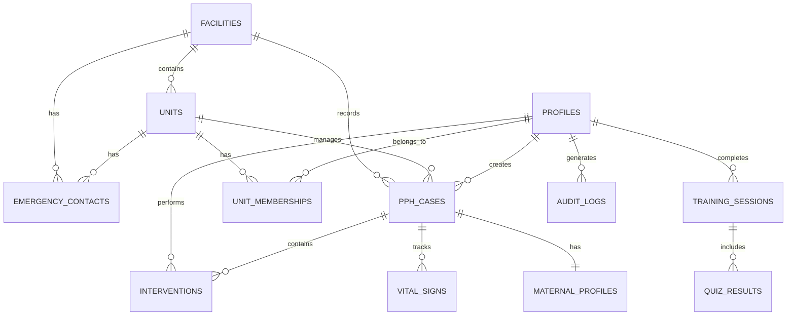

# MotivAid - Database Schema (Unit-Based Architecture)

## Overview

The database uses **Supabase PostgreSQL** with Row-Level Security (RLS) for data isolation. This schema implements a **unit-based organizational structure** where facilities contain multiple units, and users can belong to multiple units within their facility.

> [!IMPORTANT]
> This is a **fresh schema** replacing the previous facility-only model. Users are now represented in the `profiles` table (not `users`).

---

## Entity Relationship Diagram



---

## Core Tables

### 1. facilities
> Healthcare institutions (hospitals, clinics, health centers)

| Column | Type | Constraints | Description |
|--------|------|-------------|-------------|
| id | UUID | PK, DEFAULT gen_random_uuid() | Unique identifier |
| name | TEXT | NOT NULL | Facility name |
| code | TEXT | UNIQUE, NOT NULL | Facility code (e.g., "GH-001") |
| type | TEXT | CHECK | hospital/clinic/health_center/primary_health_center |
| address | TEXT | | Physical address |
| state | TEXT | | State/region |
| lga | TEXT | | Local Government Area |
| phone | TEXT | | Contact phone number |
| email | TEXT | | Contact email |
| is_active | BOOLEAN | DEFAULT true | Active status |
| created_at | TIMESTAMPTZ | DEFAULT now() | Creation timestamp |
| updated_at | TIMESTAMPTZ | DEFAULT now() | Last update |

**Indexes:**
```sql
CREATE INDEX idx_facilities_code ON facilities(code);
CREATE INDEX idx_facilities_state ON facilities(state);
CREATE INDEX idx_facilities_active ON facilities(is_active);
```

---

### 2. units
> Subdivisions within facilities (wards, departments, delivery units)

| Column | Type | Constraints | Description |
|--------|------|-------------|-------------|
| id | UUID | PK, DEFAULT gen_random_uuid() | Unique identifier |
| facility_id | UUID | FK → facilities, NOT NULL | Parent facility |
| name | TEXT | NOT NULL | Unit name (e.g., "Maternity Ward A") |
| code | TEXT | UNIQUE | Unit code (e.g., "GH-001-MW-A") |
| metadata | JSONB | | Flexible metadata storage |
| is_active | BOOLEAN | DEFAULT true | Active status |
| created_at | TIMESTAMPTZ | DEFAULT now() | Creation timestamp |
| updated_at | TIMESTAMPTZ | DEFAULT now() | Last update |
| created_by | UUID | FK → profiles | Creator |

**Metadata Structure (JSONB):**
```json
{
  "location": "Building A, Floor 2",
  "capacity": 20,
  "specialization": "high-risk deliveries",
  "equipment": ["ultrasound", "CTG monitor"],
  "operating_hours": "24/7"
}
```

**Indexes:**
```sql
CREATE INDEX idx_units_facility ON units(facility_id);
CREATE INDEX idx_units_code ON units(code);
CREATE INDEX idx_units_active ON units(is_active);
CREATE INDEX idx_units_metadata ON units USING GIN(metadata);
```

---

### 3. profiles
> User profiles (replaces the old `users` table)

| Column | Type | Constraints | Description |
|--------|------|-------------|-------------|
| id | UUID | PK, REFERENCES auth.users(id) | Supabase Auth user ID |
| email | TEXT | UNIQUE, NOT NULL | Login email |
| role | TEXT | NOT NULL, CHECK | midwife/supervisor/admin |
| full_name | TEXT | NOT NULL | Display name |
| phone | TEXT | | Phone number |
| avatar_url | TEXT | | Supabase Storage URL |
| bio | TEXT | | Professional bio |
| certifications_url | TEXT | | Supabase Storage URL (PDF/images) |
| approval_status | TEXT | DEFAULT 'pending', CHECK | pending/approved/rejected |
| approved_by | UUID | FK → profiles | Approving supervisor/admin |
| approved_at | TIMESTAMPTZ | | Approval timestamp |
| rejection_reason | TEXT | | Reason for rejection |
| is_active | BOOLEAN | DEFAULT true | Account status |
| last_login_at | TIMESTAMPTZ | | Last login timestamp |
| created_at | TIMESTAMPTZ | DEFAULT now() | Registration timestamp |
| updated_at | TIMESTAMPTZ | DEFAULT now() | Last update |

**Role Check Constraint:**
```sql
ALTER TABLE profiles ADD CONSTRAINT check_role 
  CHECK (role IN ('midwife', 'supervisor', 'admin'));
```

**Approval Status Check:**
```sql
ALTER TABLE profiles ADD CONSTRAINT check_approval_status 
  CHECK (approval_status IN ('pending', 'approved', 'rejected'));
```

**Indexes:**
```sql
CREATE INDEX idx_profiles_email ON profiles(email);
CREATE INDEX idx_profiles_role ON profiles(role);
CREATE INDEX idx_profiles_approval_status ON profiles(approval_status);
CREATE INDEX idx_profiles_approved_by ON profiles(approved_by);
```

---

### 4. unit_memberships
> Many-to-many relationship: profiles ↔ units

| Column | Type | Constraints | Description |
|--------|------|-------------|-------------|
| id | UUID | PK, DEFAULT gen_random_uuid() | Unique identifier |
| profile_id | UUID | FK → profiles, NOT NULL | User profile |
| unit_id | UUID | FK → units, NOT NULL | Unit |
| status | TEXT | DEFAULT 'approved', CHECK | pending/approved/rejected |
| is_primary | BOOLEAN | DEFAULT false | Primary unit for user |
| approved_by | UUID | FK → profiles | Approving supervisor |
| approved_at | TIMESTAMPTZ | | Approval timestamp |
| created_at | TIMESTAMPTZ | DEFAULT now() | Request timestamp |

**Constraints:**
```sql
-- Unique profile-unit combination
ALTER TABLE unit_memberships 
  ADD CONSTRAINT unique_profile_unit UNIQUE (profile_id, unit_id);

-- Status check
ALTER TABLE unit_memberships ADD CONSTRAINT check_membership_status 
  CHECK (status IN ('pending', 'approved', 'rejected'));

-- Only one primary unit per user
CREATE UNIQUE INDEX idx_unit_memberships_primary 
  ON unit_memberships (profile_id) 
  WHERE is_primary = true;
```

**Indexes:**
```sql
CREATE INDEX idx_unit_memberships_profile ON unit_memberships(profile_id);
CREATE INDEX idx_unit_memberships_unit ON unit_memberships(unit_id);
CREATE INDEX idx_unit_memberships_status ON unit_memberships(status);
```

---

### 5. maternal_profiles
> Patient demographic and risk data

| Column | Type | Constraints | Description |
|--------|------|-------------|-------------|
| id | UUID | PK, DEFAULT gen_random_uuid() | Unique identifier |
| facility_id | UUID | FK → facilities | Facility |
| unit_id | UUID | FK → units | Unit where patient registered |
| patient_id | TEXT | | Hospital patient ID (optional) |
| age | INTEGER | CHECK (age > 0 AND age < 120) | Maternal age |
| parity | INTEGER | CHECK (parity >= 0) | Number of previous births |
| gestational_age | INTEGER | CHECK (gestational_age BETWEEN 20 AND 45) | Weeks of pregnancy |
| has_anemia | BOOLEAN | DEFAULT false | Anemia diagnosis |
| has_pph_history | BOOLEAN | DEFAULT false | Previous PPH |
| has_multiple_pregnancy | BOOLEAN | DEFAULT false | Twins/multiples |
| has_placenta_previa | BOOLEAN | DEFAULT false | Placenta previa |
| has_hypertension | BOOLEAN | DEFAULT false | Hypertension |
| has_prolonged_labor | BOOLEAN | DEFAULT false | Prolonged labor |
| other_risk_factors | TEXT[] | | Array of other factors |
| risk_level | TEXT | CHECK | low/medium/high/critical |
| risk_score | INTEGER | | Calculated risk score (0-100) |
| created_at | TIMESTAMPTZ | DEFAULT now() | Creation timestamp |
| created_by | UUID | FK → profiles, NOT NULL | Creating midwife |

**Indexes:**
```sql
CREATE INDEX idx_maternal_profiles_facility ON maternal_profiles(facility_id);
CREATE INDEX idx_maternal_profiles_unit ON maternal_profiles(unit_id);
CREATE INDEX idx_maternal_profiles_risk_level ON maternal_profiles(risk_level);
CREATE INDEX idx_maternal_profiles_created_by ON maternal_profiles(created_by);
```

---

### 6. pph_cases
> PPH clinical episodes

| Column | Type | Constraints | Description |
|--------|------|-------------|-------------|
| id | UUID | PK, DEFAULT gen_random_uuid() | Unique identifier |
| facility_id | UUID | FK → facilities, NOT NULL | Facility |
| unit_id | UUID | FK → units, NOT NULL | Managing unit |
| maternal_profile_id | UUID | FK → maternal_profiles, NOT NULL | Patient |
| midwife_id | UUID | FK → profiles, NOT NULL | Attending midwife |
| case_number | TEXT | UNIQUE, NOT NULL | Auto-generated (format: UNIT-YYYYMMDD-###) |
| delivery_time | TIMESTAMPTZ | NOT NULL | Time of delivery |
| pph_detected_time | TIMESTAMPTZ | | PPH detection time |
| status | TEXT | DEFAULT 'active', CHECK | active/resolved/referred/maternal_death |
| blood_loss_ml | INTEGER | CHECK (blood_loss_ml >= 0) | Estimated blood loss |
| shock_index | DECIMAL(4,2) | | Last calculated shock index |
| outcome | TEXT | CHECK | resolved/referred/death |
| notes | TEXT | | Clinical notes |
| started_at | TIMESTAMPTZ | DEFAULT now() | Case start time |
| ended_at | TIMESTAMPTZ | | Case end time |
| duration_minutes | INTEGER | GENERATED ALWAYS AS (EXTRACT(EPOCH FROM (ended_at - started_at))/60) STORED | Case duration |
| is_synced | BOOLEAN | DEFAULT false | Sync status (offline mode) |
| local_id | TEXT | | Local device ID (offline mode) |
| created_at | TIMESTAMPTZ | DEFAULT now() | |
| updated_at | TIMESTAMPTZ | DEFAULT now() | |

**Status Check:**
```sql
ALTER TABLE pph_cases ADD CONSTRAINT check_case_status 
  CHECK (status IN ('active', 'resolved', 'referred', 'maternal_death'));

ALTER TABLE pph_cases ADD CONSTRAINT check_case_outcome 
  CHECK (outcome IN ('resolved', 'referred', 'death'));
```

**Indexes:**
```sql
CREATE INDEX idx_pph_cases_facility ON pph_cases(facility_id);
CREATE INDEX idx_pph_cases_unit ON pph_cases(unit_id);
CREATE INDEX idx_pph_cases_midwife ON pph_cases(midwife_id);
CREATE INDEX idx_pph_cases_status ON pph_cases(status);
CREATE INDEX idx_pph_cases_case_number ON pph_cases(case_number);
CREATE INDEX idx_pph_cases_created_at ON pph_cases(created_at DESC);
```

---

### 7. interventions
> E-MOTIVE steps and medications administered

| Column | Type | Constraints | Description |
|--------|------|-------------|-------------|
| id | UUID | PK, DEFAULT gen_random_uuid() | Unique identifier |
| pph_case_id | UUID | FK → pph_cases, NOT NULL, ON DELETE CASCADE | Parent case |
| type | TEXT | NOT NULL, CHECK | Intervention type |
| name | TEXT | NOT NULL | Intervention name |
| performed_at | TIMESTAMPTZ | DEFAULT now() | Timestamp |
| performed_by | UUID | FK → profiles, NOT NULL | Performing user |
| dosage | TEXT | | Medication dosage |
| route | TEXT | | Administration route |
| notes | TEXT | | Additional notes |
| is_completed | BOOLEAN | DEFAULT true | Completion status |
| order_sequence | INTEGER | | E-MOTIVE step sequence |

**Intervention Types:**
```sql
ALTER TABLE interventions ADD CONSTRAINT check_intervention_type 
  CHECK (type IN (
    'early_detection',
    'uterine_massage',
    'oxytocin',
    'misoprostol',
    'tranexamic_acid',
    'iv_fluids',
    'examination',
    'escalation',
    'referral',
    'other'
  ));
```

**Indexes:**
```sql
CREATE INDEX idx_interventions_case ON interventions(pph_case_id);
CREATE INDEX idx_interventions_performed_by ON interventions(performed_by);
CREATE INDEX idx_interventions_type ON interventions(type);
CREATE INDEX idx_interventions_performed_at ON interventions(performed_at);
```

---

### 8. vital_signs
> Patient vital signs during PPH monitoring

| Column | Type | Constraints | Description |
|--------|------|-------------|-------------|
| id | UUID | PK, DEFAULT gen_random_uuid() | Unique identifier |
| pph_case_id | UUID | FK → pph_cases, NOT NULL, ON DELETE CASCADE | Parent case |
| heart_rate | INTEGER | CHECK (heart_rate > 0 AND heart_rate < 300) | HR (bpm) |
| systolic_bp | INTEGER | CHECK (systolic_bp > 0 AND systolic_bp < 300) | SBP (mmHg) |
| diastolic_bp | INTEGER | CHECK (diastolic_bp > 0 AND diastolic_bp < 200) | DBP (mmHg) |
| shock_index | DECIMAL(4,2) | GENERATED ALWAYS AS (CASE WHEN systolic_bp > 0 THEN ROUND((heart_rate::DECIMAL / systolic_bp), 2) ELSE NULL END) STORED | Calculated SI |
| temperature | DECIMAL(3,1) | CHECK (temperature BETWEEN 30 AND 45) | Temperature (°C) |
| respiratory_rate | INTEGER | CHECK (respiratory_rate BETWEEN 0 AND 60) | RR (breaths/min) |
| spo2 | INTEGER | CHECK (spo2 BETWEEN 0 AND 100) | O2 saturation (%) |
| recorded_at | TIMESTAMPTZ | DEFAULT now() | Recording timestamp |
| recorded_by | UUID | FK → profiles, NOT NULL | Recording user |

**Indexes:**
```sql
CREATE INDEX idx_vital_signs_case ON vital_signs(pph_case_id);
CREATE INDEX idx_vital_signs_recorded_at ON vital_signs(recorded_at);
CREATE INDEX idx_vital_signs_recorded_by ON vital_signs(recorded_by);
```

---

### 9. emergency_contacts
> Emergency contacts for units and facilities

| Column | Type | Constraints | Description |
|--------|------|-------------|-------------|
| id | UUID | PK, DEFAULT gen_random_uuid() | Unique identifier |
| facility_id | UUID | FK → facilities | Facility (for facility-level contacts) |
| unit_id | UUID | FK → units | Unit (for unit-level contacts) |
| name | TEXT | NOT NULL | Contact person name |
| role | TEXT | NOT NULL | Role/position |
| phone | TEXT | NOT NULL | Phone number |
| email | TEXT | | Email address |
| priority | INTEGER | DEFAULT 1 | Contact priority (1=highest) |
| is_active | BOOLEAN | DEFAULT true | Active status |
| created_at | TIMESTAMPTZ | DEFAULT now() | |
| updated_at | TIMESTAMPTZ | DEFAULT now() | |

**Constraints:**
```sql
-- Must belong to either facility OR unit (not both, not neither)
ALTER TABLE emergency_contacts ADD CONSTRAINT check_contact_scope 
  CHECK (
    (facility_id IS NOT NULL AND unit_id IS NULL) OR 
    (facility_id IS NULL AND unit_id IS NOT NULL)
  );
```

**Indexes:**
```sql
CREATE INDEX idx_emergency_contacts_facility ON emergency_contacts(facility_id);
CREATE INDEX idx_emergency_contacts_unit ON emergency_contacts(unit_id);
CREATE INDEX idx_emergency_contacts_priority ON emergency_contacts(priority);
```

---

### 10. training_sessions
> Training and simulation attempts

| Column | Type | Constraints | Description |
|--------|------|-------------|-------------|
| id | UUID | PK, DEFAULT gen_random_uuid() | Unique identifier |
| profile_id | UUID | FK → profiles, NOT NULL | Trainee |
| scenario_id | TEXT | NOT NULL | Scenario identifier |
| scenario_difficulty | TEXT | CHECK | beginner/intermediate/advanced |
| started_at | TIMESTAMPTZ | DEFAULT now() | Start time |
| completed_at | TIMESTAMPTZ | | End time |
| score | DECIMAL(5,2) | CHECK (score BETWEEN 0 AND 100) | Score percentage |
| time_taken_seconds | INTEGER | | Duration in seconds |
| is_passed | BOOLEAN | | Pass/fail status |
| pass_threshold | DECIMAL(5,2) | DEFAULT 70 | Passing score |

**Indexes:**
```sql
CREATE INDEX idx_training_sessions_profile ON training_sessions(profile_id);
CREATE INDEX idx_training_sessions_scenario ON training_sessions(scenario_id);
CREATE INDEX idx_training_sessions_started_at ON training_sessions(started_at DESC);
```

---

### 11. quiz_results
> Quiz answers and correctness

| Column | Type | Constraints | Description |
|--------|------|-------------|-------------|
| id | UUID | PK, DEFAULT gen_random_uuid() | Unique identifier |
| training_session_id | UUID | FK → training_sessions, NOT NULL, ON DELETE CASCADE | Parent session |
| question_id | TEXT | NOT NULL | Question identifier |
| answer_given | TEXT | NOT NULL | User's answer |
| correct_answer | TEXT | NOT NULL | Correct answer |
| is_correct | BOOLEAN | NOT NULL | Correctness |
| time_taken_seconds | INTEGER | | Time to answer |

**Indexes:**
```sql
CREATE INDEX idx_quiz_results_session ON quiz_results(training_session_id);
CREATE INDEX idx_quiz_results_question ON quiz_results(question_id);
```

---

### 12. audit_logs
> System audit trail for compliance and debugging

| Column | Type | Constraints | Description |
|--------|------|-------------|-------------|
| id | UUID | PK, DEFAULT gen_random_uuid() | Unique identifier |
| profile_id | UUID | FK → profiles | Acting user |
| facility_id | UUID | FK → facilities | Related facility |
| unit_id | UUID | FK → units | Related unit |
| action | TEXT | NOT NULL | Action performed |
| entity_type | TEXT | NOT NULL | Table/resource name |
| entity_id | UUID | | Record ID |
| old_values | JSONB | | Previous values (for updates/deletes) |
| new_values | JSONB | | New values (for creates/updates) |
| ip_address | TEXT | | Client IP address |
| user_agent | TEXT | | Client user agent |
| created_at | TIMESTAMPTZ | DEFAULT now() | Log timestamp |

**Indexes:**
```sql
CREATE INDEX idx_audit_logs_profile ON audit_logs(profile_id);
CREATE INDEX idx_audit_logs_entity ON audit_logs(entity_type, entity_id);
CREATE INDEX idx_audit_logs_created_at ON audit_logs(created_at DESC);
CREATE INDEX idx_audit_logs_action ON audit_logs(action);
```

---

## Row-Level Security (RLS) Policies

### Profiles Table

```sql
-- Enable RLS
ALTER TABLE profiles ENABLE ROW LEVEL SECURITY;

-- Users can view their own profile
CREATE POLICY "Users can view own profile" 
  ON profiles FOR SELECT
  USING (auth.uid() = id);

-- Users can update their own profile
CREATE POLICY "Users can update own profile" 
  ON profiles FOR UPDATE
  USING (auth.uid() = id);

-- Supervisors can view profiles in their units
CREATE POLICY "Supervisors see unit members" 
  ON profiles FOR SELECT
  USING (
    EXISTS (
      SELECT 1 FROM profiles supervisor
      JOIN unit_memberships sm ON supervisor.id = sm.profile_id
      JOIN unit_memberships um ON sm.unit_id = um.unit_id
      WHERE supervisor.id = auth.uid()
        AND supervisor.role IN ('supervisor', 'admin')
        AND um.profile_id = profiles.id
        AND sm.status = 'approved'
    )
  );

-- Supervisors can approve pending registrations
CREATE POLICY "Supervisors approve registrations" 
  ON profiles FOR UPDATE
  USING (
    EXISTS (
      SELECT 1 FROM profiles supervisor
      WHERE supervisor.id = auth.uid()
        AND supervisor.role IN ('supervisor', 'admin')
        AND profiles.approval_status = 'pending'
    )
  );

-- Anyone can insert (for self-registration)
CREATE POLICY "Allow self-registration" 
  ON profiles FOR INSERT
  WITH CHECK (auth.uid() = id AND approval_status = 'pending');
```

---

### Units Table

```sql
ALTER TABLE units ENABLE ROW LEVEL SECURITY;

-- Users see units they belong to
CREATE POLICY "Users see their units" 
  ON units FOR SELECT
  USING (
    EXISTS (
      SELECT 1 FROM unit_memberships
      WHERE unit_id = units.id
        AND profile_id = auth.uid()
        AND status = 'approved'
    )
  );

-- Supervisors and admins can create units
CREATE POLICY "Supervisors create units" 
  ON units FOR INSERT
  WITH CHECK (
    EXISTS (
      SELECT 1 FROM profiles
      WHERE id = auth.uid()
        AND role IN ('supervisor', 'admin')
    )
  );

-- Supervisors can update their units
CREATE POLICY "Supervisors update their units" 
  ON units FOR UPDATE
  USING (
    EXISTS (
      SELECT 1 FROM unit_memberships
      WHERE unit_id = units.id
        AND profile_id = auth.uid()
        AND status = 'approved'
    )
    AND EXISTS (
      SELECT 1 FROM profiles
      WHERE id = auth.uid()
        AND role IN ('supervisor', 'admin')
    )
  );
```

---

### Unit Memberships Table

```sql
ALTER TABLE unit_memberships ENABLE ROW LEVEL SECURITY;

-- Users see their own memberships
CREATE POLICY "Users see own memberships" 
  ON unit_memberships FOR SELECT
  USING (profile_id = auth.uid());

-- Supervisors see memberships in their units
CREATE POLICY "Supervisors see unit memberships" 
  ON unit_memberships FOR SELECT
  USING (
    unit_id IN (
      SELECT unit_id FROM unit_memberships
      WHERE profile_id = auth.uid() AND status = 'approved'
    )
    AND EXISTS (
      SELECT 1 FROM profiles
      WHERE id = auth.uid() AND role IN ('supervisor', 'admin')
    )
  );

-- Users can request to join units (insert with pending status)
CREATE POLICY "Users request unit membership" 
  ON unit_memberships FOR INSERT
  WITH CHECK (
    profile_id = auth.uid() AND status = 'pending'
  );

-- Supervisors can approve/reject membership requests
CREATE POLICY "Supervisors manage memberships" 
  ON unit_memberships FOR UPDATE
  USING (
    unit_id IN (
      SELECT unit_id FROM unit_memberships
      WHERE profile_id = auth.uid() AND status = 'approved'
    )
    AND EXISTS (
      SELECT 1 FROM profiles
      WHERE id = auth.uid() AND role IN ('supervisor', 'admin')
    )
  );
```

---

### PPH Cases Table

```sql
ALTER TABLE pph_cases ENABLE ROW LEVEL SECURITY;

-- Midwives see cases in their units
CREATE POLICY "Midwives see unit cases" 
  ON pph_cases FOR SELECT
  USING (
    unit_id IN (
      SELECT unit_id FROM unit_memberships
      WHERE profile_id = auth.uid() AND status = 'approved'
    )
  );

-- Supervisors see cases in their units + facility-wide
CREATE POLICY "Supervisors see facility cases" 
  ON pph_cases FOR SELECT
  USING (
    EXISTS (
      SELECT 1 FROM profiles
      WHERE id = auth.uid() AND role IN ('supervisor', 'admin')
    )
    AND (
      -- Cases in their units
      unit_id IN (
        SELECT unit_id FROM unit_memberships
        WHERE profile_id = auth.uid() AND status = 'approved'
      )
      OR
      -- Cases in their facility
      facility_id IN (
        SELECT DISTINCT u.facility_id
        FROM unit_memberships um
        JOIN units u ON um.unit_id = u.id
        WHERE um.profile_id = auth.uid() AND um.status = 'approved'
      )
    )
  );

-- Users can create cases in their units
CREATE POLICY "Users create cases" 
  ON pph_cases FOR INSERT
  WITH CHECK (
    unit_id IN (
      SELECT unit_id FROM unit_memberships
      WHERE profile_id = auth.uid() AND status = 'approved'
    )
    AND midwife_id = auth.uid()
  );

-- Users can update cases they created
CREATE POLICY "Users update own cases" 
  ON pph_cases FOR UPDATE
  USING (midwife_id = auth.uid());
```

---

### Similar RLS Policies for Other Tables
(Apply similar patterns for interventions, vital_signs, emergency_contacts, etc.)

---

## Database Functions

### 1. Auto-generate Case Number
```sql
CREATE OR REPLACE FUNCTION generate_case_number(p_unit_id UUID)
RETURNS TEXT AS $$
DECLARE
  v_unit_code TEXT;
  v_date_part TEXT;
  v_sequence INTEGER;
  v_case_number TEXT;
BEGIN
  -- Get unit code
  SELECT code INTO v_unit_code FROM units WHERE id = p_unit_id;
  
  -- Date part: YYYYMMDD
  v_date_part := TO_CHAR(NOW(), 'YYYYMMDD');
  
  -- Get next sequence for today
  SELECT COALESCE(MAX(SUBSTRING(case_number FROM '\d+$'))::INTEGER, 0) + 1
  INTO v_sequence
  FROM pph_cases
  WHERE unit_id = p_unit_id 
    AND case_number LIKE v_unit_code || '-' || v_date_part || '%';
  
  -- Format: UNIT-YYYYMMDD-001
  v_case_number := v_unit_code || '-' || v_date_part || '-' || LPAD(v_sequence::TEXT, 3, '0');
  
  RETURN v_case_number;
END;
$$ LANGUAGE plpgsql;
```

### 2. Calculate PPH Risk Score
```sql
CREATE OR REPLACE FUNCTION calculate_risk_score(
  p_age INTEGER,
  p_parity INTEGER,
  p_has_anemia BOOLEAN,
  p_has_pph_history BOOLEAN,
  p_has_multiple_pregnancy BOOLEAN,
  p_has_placenta_previa BOOLEAN,
  p_has_hypertension BOOLEAN,
  p_has_prolonged_labor BOOLEAN
)
RETURNS INTEGER AS $$
DECLARE
  v_score INTEGER := 0;
BEGIN
  -- Age risk  IF p_age < 18 OR p_age > 35 THEN v_score := v_score + 10; END IF;
  
  -- Parity risk
  IF p_parity = 0 OR p_parity > 4 THEN v_score := v_score + 10; END IF;
  
  -- Medical history
  IF p_has_anemia THEN v_score := v_score + 15; END IF;
  IF p_has_pph_history THEN v_score := v_score + 25; END IF;
  IF p_has_multiple_pregnancy THEN v_score := v_score + 20; END IF;
  IF p_has_placenta_previa THEN v_score := v_score + 30; END IF;
  IF p_has_hypertension THEN v_score := v_score + 15; END IF;
  IF p_has_prolonged_labor THEN v_score := v_score + 15; END IF;
  
  RETURN LEAST(v_score, 100);
END;
$$ LANGUAGE plpgsql;
```

### 3. Determine Risk Level from Score
```sql
CREATE OR REPLACE FUNCTION get_risk_level(p_score INTEGER)
RETURNS TEXT AS $$
BEGIN
  IF p_score >= 60 THEN RETURN 'critical';
  ELSIF p_score >= 40 THEN RETURN 'high';
  ELSIF p_score >= 20 THEN RETURN 'medium';
  ELSE RETURN 'low';
  END IF;
END;
$$ LANGUAGE plpgsql;
```

---

## Triggers

### 1. Auto-update `updated_at` timestamp
```sql
CREATE OR REPLACE FUNCTION update_updated_at_column()
RETURNS TRIGGER AS $$
BEGIN
  NEW.updated_at = NOW();
  RETURN NEW;
END;
$$ LANGUAGE plpgsql;

-- Apply to all relevant tables
CREATE TRIGGER update_facilities_updated_at 
  BEFORE UPDATE ON facilities
  FOR EACH ROW EXECUTE FUNCTION update_updated_at_column();

CREATE TRIGGER update_units_updated_at 
  BEFORE UPDATE ON units
  FOR EACH ROW EXECUTE FUNCTION update_updated_at_column();

CREATE TRIGGER update_profiles_updated_at 
  BEFORE UPDATE ON profiles
  FOR EACH ROW EXECUTE FUNCTION update_updated_at_column();

-- ... (repeat for other tables with updated_at)
```

### 2. Auto-generate case number on insert
```sql
CREATE OR REPLACE FUNCTION auto_generate_case_number()
RETURNS TRIGGER AS $$
BEGIN
  IF NEW.case_number IS NULL THEN
    NEW.case_number := generate_case_number(NEW.unit_id);
  END IF;
  RETURN NEW;
END;
$$ LANGUAGE plpgsql;

CREATE TRIGGER trigger_auto_case_number
  BEFORE INSERT ON pph_cases
  FOR EACH ROW EXECUTE FUNCTION auto_generate_case_number();
```

### 3. Audit logging trigger
```sql
CREATE OR REPLACE FUNCTION log_audit()
RETURNS TRIGGER AS $$
BEGIN
  INSERT INTO audit_logs (
    profile_id, action, entity_type, entity_id, 
    old_values, new_values
  ) VALUES (
    auth.uid(),
    TG_OP,
    TG_TABLE_NAME,
    COALESCE(NEW.id, OLD.id),
    CASE WHEN TG_OP IN ('UPDATE', 'DELETE') THEN to_jsonb(OLD) ELSE NULL END,
    CASE WHEN TG_OP IN ('INSERT', 'UPDATE') THEN to_jsonb(NEW) ELSE NULL END
  );
  RETURN COALESCE(NEW, OLD);
END;
$$ LANGUAGE plpgsql;

-- Apply selectively to sensitive tables
CREATE TRIGGER audit_profiles 
  AFTER INSERT OR UPDATE OR DELETE ON profiles
  FOR EACH ROW EXECUTE FUNCTION log_audit();

CREATE TRIGGER audit_pph_cases 
  AFTER INSERT OR UPDATE OR DELETE ON pph_cases
  FOR EACH ROW EXECUTE FUNCTION log_audit();
```

---

## Storage Buckets

### Configure Supabase Storage

```sql
-- Avatars bucket (public read, authenticated write)
INSERT INTO storage.buckets (id, name, public)
VALUES ('avatars', 'avatars', true);

-- Certifications bucket (private, only owners can read)
INSERT INTO storage.buckets (id, name, public)
VALUES ('certifications', 'certifications', false);

-- Reports bucket (private)
INSERT INTO storage.buckets (id, name, public)
VALUES ('reports', 'reports', false);
```

### Storage Policies

```sql
-- Avatars: Anyone can upload their own
CREATE POLICY "Users upload own avatar"
  ON storage.objects FOR INSERT
  WITH CHECK (
    bucket_id = 'avatars' AND 
    auth.uid()::TEXT = (storage.foldername(name))[1]
  );

-- Avatars: Users can update their own
CREATE POLICY "Users update own avatar"
  ON storage.objects FOR UPDATE
  USING (
    bucket_id = 'avatars' AND 
    auth.uid()::TEXT = (storage.foldername(name))[1]
  );

-- Certifications: Users upload their own
CREATE POLICY "Users upload own certifications"
  ON storage.objects FOR INSERT
  WITH CHECK (
    bucket_id = 'certifications' AND 
    auth.uid()::TEXT = (storage.foldername(name))[1]
  );

-- Supervisors can view certifications of unit members
CREATE POLICY "Supervisors view unit certifications"
  ON storage.objects FOR SELECT
  USING (
    bucket_id = 'certifications' AND
    EXISTS (
      SELECT 1 FROM profiles p
      JOIN unit_memberships um ON p.id = um.profile_id
      WHERE p.id = auth.uid()
        AND p.role IN ('supervisor', 'admin')
        AND um.status = 'approved'
        AND (storage.foldername(name))[1] IN (
          SELECT um2.profile_id::TEXT
          FROM unit_memberships um2
          WHERE um2.unit_id = um.unit_id
        )
    )
  );
```

---

## Migration Files (Supabase CLI)

### File Structure
```
supabase/
├── config.toml
└── migrations/
    ├── 20260126000001_create_facilities.sql
    ├── 20260126000002_create_units.sql
    ├── 20260126000003_create_profiles.sql
    ├── 20260126000004_create_unit_memberships.sql
    ├── 20260126000005_create_maternal_profiles.sql
    ├── 20260126000006_create_pph_cases.sql
    ├── 20260126000007_create_interventions.sql
    ├── 20260126000008_create_vital_signs.sql
    ├── 20260126000009_create_emergency_contacts.sql
    ├── 20260126000010_create_training_tables.sql
    ├── 20260126000011_create_audit_logs.sql
    ├── 20260126000012_create_functions.sql
    ├── 20260126000013_create_triggers.sql
    ├── 20260126000014_create_rls_policies.sql
    └── 20260126000015_create_storage_buckets.sql
```

### Running Migrations
```bash
# Apply all migrations
npx supabase migration up

# Create new migration
npx supabase migration new migration_name

# Reset database (WARNING: deletes all data)
npx supabase db reset
```

---

## Sample Data (for Testing)

```sql
-- Insert sample facility
INSERT INTO facilities (id, name, code, type, state)
VALUES (
  'a0eebc99-9c0b-4ef8-bb6d-6bb9bd380a11',
  'General Hospital Lagos',
  'GH-LG-001',
  'hospital',
  'Lagos'
);

-- Insert sample units
INSERT INTO units (id, facility_id, name, code, metadata)
VALUES 
  ('b0eebc99-9c0b-4ef8-bb6d-6bb9bd380a12', 
   'a0eebc99-9c0b-4ef8-bb6d-6bb9bd380a11',
   'Maternity Ward A',
   'GH-LG-001-MW-A',
   '{"location": "Building A, Floor 2", "capacity": 20}'::jsonb),
  ('c0eebc99-9c0b-4ef8-bb6d-6bb9bd380a13',
   'a0eebc99-9c0b-4ef8-bb6d-6bb9bd380a11',
   'Emergency Delivery Unit',
   'GH-LG-001-EDU',
   '{"location": "Building B, Floor 1", "capacity": 10}'::jsonb);
```

---

**Document Version:** 2.0 (Unit-Based Architecture)  
**Last Updated:** 2026-01-26  
**Supabase Version:** PostgreSQL 14+  
**Status:** Ready for Migration
