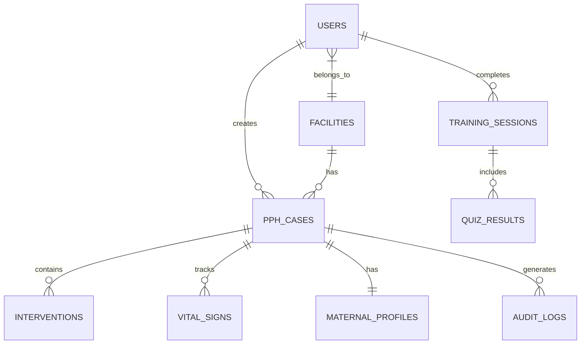

# MotivAid - Database Schema

## Overview

The database uses **Supabase PostgreSQL** with Row-Level Security (RLS) for data isolation.

---

## Entity Relationship Diagram



---

## Core Tables

### 1. users
> User accounts and profiles

| Column | Type | Constraints | Description |
|--------|------|-------------|-------------|
| id | UUID | PK, DEFAULT gen_random_uuid() | Unique identifier |
| email | TEXT | UNIQUE, NOT NULL | Login email |
| role | TEXT | NOT NULL, CHECK | midwife/supervisor/admin |
| facility_id | UUID | FK → facilities | Assigned facility |
| full_name | TEXT | NOT NULL | Display name |
| phone | TEXT | | Contact number |
| is_active | BOOLEAN | DEFAULT true | Account status |
| created_at | TIMESTAMPTZ | DEFAULT now() | Creation timestamp |
| updated_at | TIMESTAMPTZ | DEFAULT now() | Last update |

---

### 2. facilities
> Healthcare facilities

| Column | Type | Constraints | Description |
|--------|------|-------------|-------------|
| id | UUID | PK | Unique identifier |
| name | TEXT | NOT NULL | Facility name |
| code | TEXT | UNIQUE | Facility code |
| type | TEXT | | hospital/clinic/health_center |
| address | TEXT | | Physical address |
| state | TEXT | | State/region |
| lga | TEXT | | Local Government Area |
| phone | TEXT | | Contact phone |
| is_active | BOOLEAN | DEFAULT true | Status |
| created_at | TIMESTAMPTZ | DEFAULT now() | |

---

### 3. maternal_profiles
> Patient demographic and risk data

| Column | Type | Constraints | Description |
|--------|------|-------------|-------------|
| id | UUID | PK | Unique identifier |
| facility_id | UUID | FK → facilities | Facility |
| patient_id | TEXT | | Hospital ID (optional) |
| age | INTEGER | CHECK (age > 0) | Maternal age |
| parity | INTEGER | | Number of births |
| gestational_age | INTEGER | | Weeks of pregnancy |
| has_anemia | BOOLEAN | DEFAULT false | Anemia status |
| has_pph_history | BOOLEAN | DEFAULT false | Previous PPH |
| has_multiple_pregnancy | BOOLEAN | DEFAULT false | Twins/multiples |
| has_placenta_previa | BOOLEAN | DEFAULT false | Placenta previa |
| risk_level | TEXT | | low/medium/high/critical |
| created_at | TIMESTAMPTZ | DEFAULT now() | |
| created_by | UUID | FK → users | Created by user |

---

### 4. pph_cases
> PPH clinical episodes

| Column | Type | Constraints | Description |
|--------|------|-------------|-------------|
| id | UUID | PK | Unique identifier |
| facility_id | UUID | FK → facilities | Facility |
| maternal_profile_id | UUID | FK → maternal_profiles | Patient |
| midwife_id | UUID | FK → users | Attending midwife |
| case_number | TEXT | UNIQUE | Auto-generated |
| delivery_time | TIMESTAMPTZ | | Time of delivery |
| pph_detected_time | TIMESTAMPTZ | | PPH detection time |
| status | TEXT | | active/resolved/referred/maternal_death |
| blood_loss_ml | INTEGER | | Estimated blood loss |
| shock_index | DECIMAL(3,2) | | Last shock index |
| outcome | TEXT | | resolved/referred/death |
| notes | TEXT | | Clinical notes |
| started_at | TIMESTAMPTZ | DEFAULT now() | Case start |
| ended_at | TIMESTAMPTZ | | Case end |
| is_synced | BOOLEAN | DEFAULT false | Sync status |
| local_id | TEXT | | Local device ID |

---

### 5. interventions
> E-MOTIVE steps and medications given

| Column | Type | Constraints | Description |
|--------|------|-------------|-------------|
| id | UUID | PK | Unique identifier |
| pph_case_id | UUID | FK → pph_cases | Parent case |
| type | TEXT | NOT NULL | Step type |
| name | TEXT | NOT NULL | Intervention name |
| performed_at | TIMESTAMPTZ | DEFAULT now() | Time performed |
| performed_by | UUID | FK → users | Performed by |
| dosage | TEXT | | Medication dosage |
| route | TEXT | | Administration route |
| notes | TEXT | | Additional notes |
| is_completed | BOOLEAN | DEFAULT false | Completion status |

**Intervention Types:**
- `early_detection`
- `uterine_massage`
- `oxytocin`
- `misoprostol`
- `tranexamic_acid`
- `iv_fluids`
- `examination`
- `escalation`
- `referral`

---

### 6. vital_signs
> Patient vital signs during PPH

| Column | Type | Constraints | Description |
|--------|------|-------------|-------------|
| id | UUID | PK | Unique identifier |
| pph_case_id | UUID | FK → pph_cases | Parent case |
| heart_rate | INTEGER | | HR (bpm) |
| systolic_bp | INTEGER | | SBP (mmHg) |
| diastolic_bp | INTEGER | | DBP (mmHg) |
| shock_index | DECIMAL(3,2) | | Calculated SI |
| temperature | DECIMAL(3,1) | | Temp (°C) |
| respiratory_rate | INTEGER | | RR (breaths/min) |
| spo2 | INTEGER | | O2 saturation (%) |
| recorded_at | TIMESTAMPTZ | DEFAULT now() | Time recorded |
| recorded_by | UUID | FK → users | Recorded by |

---

### 7. training_sessions
> Training and simulation attempts

| Column | Type | Constraints | Description |
|--------|------|-------------|-------------|
| id | UUID | PK | Unique identifier |
| user_id | UUID | FK → users | Trainee |
| scenario_id | TEXT | | Scenario identifier |
| started_at | TIMESTAMPTZ | DEFAULT now() | Start time |
| completed_at | TIMESTAMPTZ | | End time |
| score | DECIMAL(5,2) | | Score percentage |
| time_taken_seconds | INTEGER | | Duration |
| is_passed | BOOLEAN | | Pass/fail |

---

### 8. quiz_results
> Quiz answers and scores

| Column | Type | Constraints | Description |
|--------|------|-------------|-------------|
| id | UUID | PK | Unique identifier |
| training_session_id | UUID | FK → training_sessions | Session |
| question_id | TEXT | | Question identifier |
| answer_given | TEXT | | User's answer |
| is_correct | BOOLEAN | | Correctness |
| time_taken_seconds | INTEGER | | Time to answer |

---

### 9. audit_logs
> System audit trail

| Column | Type | Constraints | Description |
|--------|------|-------------|-------------|
| id | UUID | PK | Unique identifier |
| user_id | UUID | FK → users | Acting user |
| facility_id | UUID | FK → facilities | Facility |
| action | TEXT | NOT NULL | Action type |
| entity_type | TEXT | | Table name |
| entity_id | UUID | | Record ID |
| old_values | JSONB | | Previous values |
| new_values | JSONB | | New values |
| ip_address | TEXT | | Client IP |
| user_agent | TEXT | | Client UA |
| created_at | TIMESTAMPTZ | DEFAULT now() | |

---

### 10. emergency_contacts
> Facility emergency contacts

| Column | Type | Constraints | Description |
|--------|------|-------------|-------------|
| id | UUID | PK | Unique identifier |
| facility_id | UUID | FK → facilities | Facility |
| name | TEXT | NOT NULL | Contact name |
| role | TEXT | | obstetrician/anesthetist/senior_midwife |
| phone | TEXT | NOT NULL | Phone number |
| is_active | BOOLEAN | DEFAULT true | Status |

---

## SQL Creation Script

```sql
-- Enable UUID extension
CREATE EXTENSION IF NOT EXISTS "uuid-ossp";

-- Facilities table
CREATE TABLE facilities (
  id UUID PRIMARY KEY DEFAULT gen_random_uuid(),
  name TEXT NOT NULL,
  code TEXT UNIQUE,
  type TEXT,
  address TEXT,
  state TEXT,
  lga TEXT,
  phone TEXT,
  is_active BOOLEAN DEFAULT true,
  created_at TIMESTAMPTZ DEFAULT now()
);

-- Users table
CREATE TABLE users (
  id UUID PRIMARY KEY DEFAULT gen_random_uuid(),
  email TEXT UNIQUE NOT NULL,
  role TEXT NOT NULL CHECK (role IN ('midwife', 'supervisor', 'admin')),
  facility_id UUID REFERENCES facilities(id),
  full_name TEXT NOT NULL,
  phone TEXT,
  is_active BOOLEAN DEFAULT true,
  created_at TIMESTAMPTZ DEFAULT now(),
  updated_at TIMESTAMPTZ DEFAULT now()
);

-- Maternal profiles table
CREATE TABLE maternal_profiles (
  id UUID PRIMARY KEY DEFAULT gen_random_uuid(),
  facility_id UUID REFERENCES facilities(id),
  patient_id TEXT,
  age INTEGER CHECK (age > 0),
  parity INTEGER,
  gestational_age INTEGER,
  has_anemia BOOLEAN DEFAULT false,
  has_pph_history BOOLEAN DEFAULT false,
  has_multiple_pregnancy BOOLEAN DEFAULT false,
  has_placenta_previa BOOLEAN DEFAULT false,
  risk_level TEXT CHECK (risk_level IN ('low', 'medium', 'high', 'critical')),
  created_at TIMESTAMPTZ DEFAULT now(),
  created_by UUID REFERENCES users(id)
);

-- PPH cases table
CREATE TABLE pph_cases (
  id UUID PRIMARY KEY DEFAULT gen_random_uuid(),
  facility_id UUID REFERENCES facilities(id),
  maternal_profile_id UUID REFERENCES maternal_profiles(id),
  midwife_id UUID REFERENCES users(id),
  case_number TEXT UNIQUE,
  delivery_time TIMESTAMPTZ,
  pph_detected_time TIMESTAMPTZ,
  status TEXT CHECK (status IN ('active', 'resolved', 'referred', 'maternal_death')),
  blood_loss_ml INTEGER,
  shock_index DECIMAL(3,2),
  outcome TEXT,
  notes TEXT,
  started_at TIMESTAMPTZ DEFAULT now(),
  ended_at TIMESTAMPTZ,
  is_synced BOOLEAN DEFAULT false,
  local_id TEXT
);

-- Interventions table
CREATE TABLE interventions (
  id UUID PRIMARY KEY DEFAULT gen_random_uuid(),
  pph_case_id UUID REFERENCES pph_cases(id) ON DELETE CASCADE,
  type TEXT NOT NULL,
  name TEXT NOT NULL,
  performed_at TIMESTAMPTZ DEFAULT now(),
  performed_by UUID REFERENCES users(id),
  dosage TEXT,
  route TEXT,
  notes TEXT,
  is_completed BOOLEAN DEFAULT false
);

-- Vital signs table
CREATE TABLE vital_signs (
  id UUID PRIMARY KEY DEFAULT gen_random_uuid(),
  pph_case_id UUID REFERENCES pph_cases(id) ON DELETE CASCADE,
  heart_rate INTEGER,
  systolic_bp INTEGER,
  diastolic_bp INTEGER,
  shock_index DECIMAL(3,2),
  temperature DECIMAL(3,1),
  respiratory_rate INTEGER,
  spo2 INTEGER,
  recorded_at TIMESTAMPTZ DEFAULT now(),
  recorded_by UUID REFERENCES users(id)
);

-- Enable RLS on all tables
ALTER TABLE facilities ENABLE ROW LEVEL SECURITY;
ALTER TABLE users ENABLE ROW LEVEL SECURITY;
ALTER TABLE maternal_profiles ENABLE ROW LEVEL SECURITY;
ALTER TABLE pph_cases ENABLE ROW LEVEL SECURITY;
ALTER TABLE interventions ENABLE ROW LEVEL SECURITY;
ALTER TABLE vital_signs ENABLE ROW LEVEL SECURITY;
```

---

## Indexes

```sql
-- Performance indexes
CREATE INDEX idx_users_facility ON users(facility_id);
CREATE INDEX idx_users_role ON users(role);
CREATE INDEX idx_pph_cases_facility ON pph_cases(facility_id);
CREATE INDEX idx_pph_cases_midwife ON pph_cases(midwife_id);
CREATE INDEX idx_pph_cases_status ON pph_cases(status);
CREATE INDEX idx_interventions_case ON interventions(pph_case_id);
CREATE INDEX idx_vital_signs_case ON vital_signs(pph_case_id);
```
