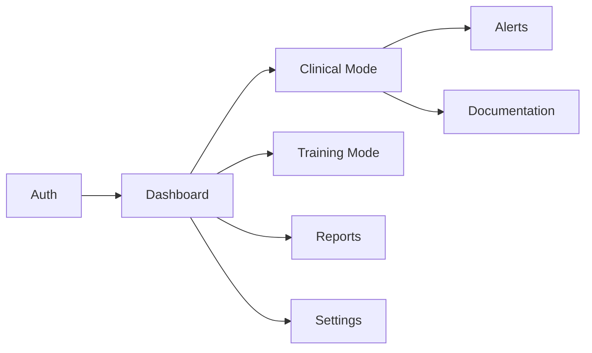

# MotivAid - Modules & Features

## Module Overview



---

## 1. Authentication Module

### Features
| Feature | Description | Priority |
|---------|-------------|----------|
| Login | Email/password authentication | P0 |
| Logout | Secure session termination | P0 |
| Session Management | JWT token handling | P0 |
| Offline Auth | Cached credentials for offline | P0 |

### Screens
- `LoginScreen` - Authentication form
- `ForgotPasswordScreen` - Password recovery

### Files
```
features/auth/
├── data/
│   ├── repositories/auth_repository.dart
│   └── sources/auth_remote_source.dart
├── domain/
│   ├── entities/user.dart
│   └── usecases/login_usecase.dart
└── presentation/
    ├── screens/login_screen.dart
    ├── widgets/login_form.dart
    └── providers/auth_provider.dart
```

---

## 2. Dashboard Module

### Features
| Feature | Description | Priority |
|---------|-------------|----------|
| Mode Selection | Clinical/Training mode entry | P0 |
| Quick Stats | Cases, alerts, sync status | P1 |
| Recent Cases | Last 5 PPH cases | P1 |
| Sync Status | Online/offline indicator | P0 |

### Screens
- `DashboardScreen` - Main home screen

---

## 3. Clinical Mode Module

### Features
| Feature | Description | Priority |
|---------|-------------|----------|
| Risk Assessment | Maternal risk factor entry | P0 |
| Risk Profile | Auto-generated PPH risk level | P0 |
| E-MOTIVE Checklist | Step-by-step clinical workflow | P0 |
| Vital Signs | HR, BP, shock index calculation | P0 |
| Blood Loss Tracking | Visual estimation guides | P0 |
| Timer | PPH monitoring countdown | P0 |
| Alerts | Threshold-based warnings | P0 |
| Escalation | One-tap emergency notification | P0 |
| Documentation | Automatic event logging | P0 |

### Screens
- `RiskAssessmentScreen` - Maternal data entry
- `ClinicalModeScreen` - Active PPH management
- `ChecklistScreen` - E-MOTIVE steps
- `VitalSignsScreen` - Vital signs entry
- `EscalationScreen` - Emergency contacts

### E-MOTIVE Workflow
```
┌─────────────────────────────────────────────┐
│  E-MOTIVE CHECKLIST                         │
├─────────────────────────────────────────────┤
│  □ Early Detection                          │
│    └─ Blood loss estimation                 │
│    └─ Vital signs check                     │
│                                              │
│  □ Massage (Uterine)                        │
│    └─ Bimanual compression                  │
│                                              │
│  □ Oxytocics                                │
│    └─ Oxytocin (10 IU IM/IV)               │
│    └─ Alternative: Misoprostol             │
│                                              │
│  □ Tranexamic Acid                          │
│    └─ 1g IV within 3 hours                 │
│                                              │
│  □ IV Fluids                                │
│    └─ Crystalloids (Ringer's/NS)           │
│                                              │
│  □ Examination                              │
│    └─ Inspect for tears                    │
│    └─ Check for retained products          │
│                                              │
│  □ Escalation                               │
│    └─ Call for help                        │
│    └─ Prepare referral                     │
└─────────────────────────────────────────────┘
```

---

## 4. Training Module

### Features
| Feature | Description | Priority |
|---------|-------------|----------|
| Scenarios | Simulated PPH cases | P1 |
| Quizzes | MCQ assessments | P1 |
| Case Studies | Interactive decision trees | P1 |
| Progress Tracking | Performance history | P2 |
| Certificates | Completion badges | P2 |

### Screens
- `TrainingHomeScreen` - Module selection
- `ScenarioScreen` - Interactive scenario
- `QuizScreen` - Assessment questions
- `ResultsScreen` - Score and feedback
- `ProgressScreen` - Training history

---

## 5. Reports Module

### Features
| Feature | Description | Priority |
|---------|-------------|----------|
| Case Reports | Individual PPH case summaries | P1 |
| Facility Reports | Aggregated metrics | P1 |
| E-MOTIVE Adherence | Compliance tracking | P1 |
| Export | PDF/CSV generation | P2 |

### Screens
- `ReportsListScreen` - Report list
- `CaseReportScreen` - Single case detail
- `AnalyticsScreen` - Facility metrics

---

## 6. Settings Module

### Features
| Feature | Description | Priority |
|---------|-------------|----------|
| Profile | User information | P1 |
| Notifications | Alert preferences | P1 |
| Facility | Facility configuration | P1 |
| Emergency Contacts | Team contact list | P0 |
| Data Management | Sync, clear cache | P1 |
| About | Version, licenses | P2 |

### Screens
- `SettingsScreen` - Settings menu
- `ProfileScreen` - User profile edit
- `EmergencyContactsScreen` - Contact management

---

## Shared Components

### Widgets
| Widget | Usage |
|--------|-------|
| `MotivaidButton` | Primary action buttons |
| `MotivaidCard` | Content cards |
| `AlertBanner` | Warning/error banners |
| `ChecklistItem` | E-MOTIVE step item |
| `VitalSignsInput` | HR/BP input fields |
| `TimerWidget` | Countdown display |
| `SyncIndicator` | Online/offline status |

### Services
| Service | Responsibility |
|---------|----------------|
| `SyncService` | Data synchronization |
| `NotificationService` | Local + push notifications |
| `AlertService` | Clinical alert triggers |
| `AnalyticsService` | Event tracking |
