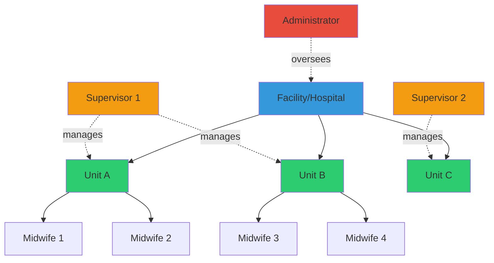
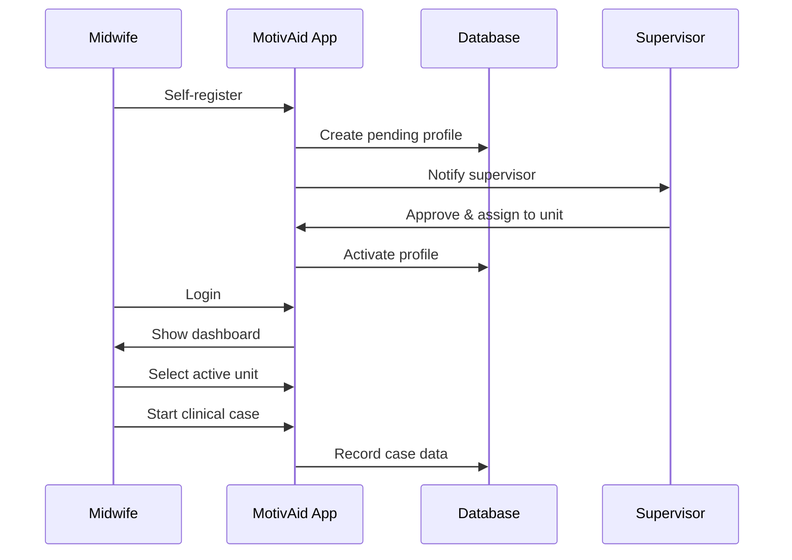
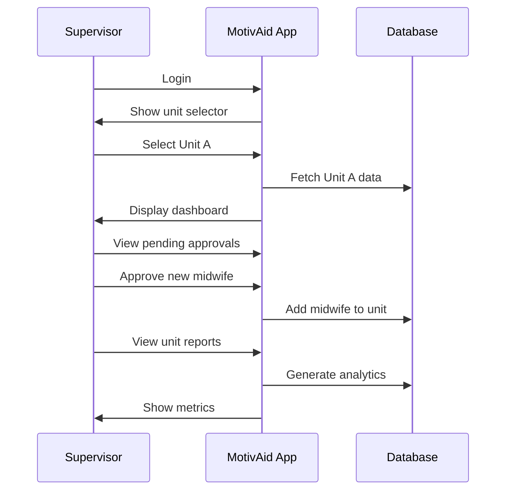

# MotivAid - System Description

## System Overview

**MotivAid** is a mobile health application designed to support midwives and frontline healthcare workers in the early detection, prevention, and management of postpartum hemorrhage (PPH) using the WHO-endorsed E-MOTIVE clinical bundle. The system is organized around **facilities** and **units**, enabling hierarchical management and oversight.

---

## Organizational Structure



### Key Concepts

| Concept | Description |
|---------|-------------|
| **Facility** | A healthcare institution (e.g., General Hospital, Primary Health Center) |
| **Unit** | A subdivision within a facility (e.g., Maternity Ward A, Emergency Delivery Unit) |
| **User Roles** | Midwife, Supervisor, Administrator |
| **Membership** | Users can belong to multiple units within the same facility |
| **Supervision** | Supervisors can manage multiple units across facilities |

---

## User Roles & Responsibilities

### 1. Midwife (Frontline User)

**Primary Function:** Direct patient care and PPH management

**Capabilities:**
- ✅ Register and manage their profile
- ✅ Join units within their facility (requires supervisor approval)
- ✅ Access clinical mode for PPH management
- ✅ Complete E-MOTIVE checklists during deliveries
- ✅ Record vital signs and interventions
- ✅ Trigger emergency escalations
- ✅ Access training and simulation modules
- ✅ View their own case history
- ✅ Switch between units (if member of multiple)

**Workflow:**


---

### 2. Supervisor (Unit Manager)

**Primary Function:** Unit oversight, quality assurance, and team management

**Capabilities:**
- ✅ Manage multiple units
- ✅ Create and rename units
- ✅ Approve/reject user registration requests
- ✅ Add/remove users from their units
- ✅ View all cases within their units
- ✅ View cases across their facility
- ✅ Access aggregate reports for their units
- ✅ Compare performance across units they manage
- ✅ Configure unit settings and metadata
- ✅ Manage emergency contacts for their units
- ✅ Access training modules

**Dashboard Features:**
- Unit selection dropdown (if managing multiple)
- Active cases in selected unit
- E-MOTIVE adherence metrics
- Team performance statistics
- Pending user approvals
- Recent alerts and escalations

**Workflow:**


---

### 3. Administrator (System Manager)

**Primary Function:** System-wide configuration and cross-facility management

**Capabilities:**
- ✅ Create and manage facilities
- ✅ Create and manage units across all facilities
- ✅ Create user accounts (all roles)
- ✅ Assign users to units and facilities
- ✅ View all data across all facilities
- ✅ Generate system-wide reports
- ✅ Configure system settings
- ✅ Access audit logs
- ✅ Manage emergency contacts globally
- ✅ Export data for research/analysis

> [!IMPORTANT]
> Administrator panel will be implemented separately using Next.js for web-based management.

---

## Core Workflows

### Workflow 1: User Onboarding (Self-Registration)

```
┌─────────────────────────────────────────────────────────────┐
│ STEP 1: Registration                                         │
├─────────────────────────────────────────────────────────────┤
│ • Midwife downloads app                                      │
│ • Fills registration form:                                   │
│   - Email, password                                          │
│   - Full name, phone                                         │
│   - Select facility from dropdown                            │
│   - Request to join specific unit(s)                         │
│   - Upload avatar (optional)                                 │
│   - Add bio, certifications                                  │
│ • Submit registration                                        │
└─────────────────────────────────────────────────────────────┘
                          ↓
┌─────────────────────────────────────────────────────────────┐
│ STEP 2: Supervisor Approval                                  │
├─────────────────────────────────────────────────────────────┤
│ • Supervisor receives notification                           │
│ • Reviews profile and credentials                            │
│ • Approves or rejects request                                │
│ • If approved: Assigns to requested unit(s)                  │
└─────────────────────────────────────────────────────────────┘
                          ↓
┌─────────────────────────────────────────────────────────────┐
│ STEP 3: Account Activation                                   │
├─────────────────────────────────────────────────────────────┤
│ • User receives approval notification                        │
│ • Can now login to the app                                   │
│ • Default unit is pre-selected                               │
└─────────────────────────────────────────────────────────────┘
```

---

### Workflow 2: Clinical Mode (PPH Management)

```
┌─────────────────────────────────────────────────────────────┐
│ STEP 1: Pre-Delivery Preparation                            │
├─────────────────────────────────────────────────────────────┤
│ • Midwife logs in                                            │
│ • Selects active unit from dropdown                          │
│ • Navigates to Clinical Mode                                 │
│ • Enters maternal risk factors:                              │
│   - Age, parity, gestational age                             │
│   - Medical history (anemia, previous PPH, etc.)             │
│ • System calculates risk profile                             │
│ • Displays preparedness recommendations                      │
└─────────────────────────────────────────────────────────────┘
                          ↓
┌─────────────────────────────────────────────────────────────┐
│ STEP 2: Delivery & Monitoring                                │
├─────────────────────────────────────────────────────────────┤
│ • Record delivery time                                       │
│ • Monitoring timer starts (1 hour PPH watch)                 │
│ • Record initial vital signs                                 │
│ • Estimate blood loss                                        │
└─────────────────────────────────────────────────────────────┘
                          ↓
┌─────────────────────────────────────────────────────────────┐
│ STEP 3: E-MOTIVE Checklist (If PPH Detected)                │
├─────────────────────────────────────────────────────────────┤
│ ☐ Early Detection                                            │
│   └─ Blood loss >500ml OR clinical signs                     │
│ ☐ Massage (Uterine massage)                                 │
│ ☐ Oxytocics (Oxytocin/Misoprostol)                          │
│ ☐ Tranexamic Acid (within 3 hours)                          │
│ ☐ IV Fluids                                                  │
│ ☐ Examination (source identification)                        │
│ ☐ Escalation (if not improving)                             │
└─────────────────────────────────────────────────────────────┘
                          ↓
┌─────────────────────────────────────────────────────────────┐
│ STEP 4: Documentation & Case Closure                         │
├─────────────────────────────────────────────────────────────┤
│ • System automatically logs all interventions                │
│ • Record final outcome (resolved/referred/death)             │
│ • Add clinical notes                                         │
│ • Close case                                                 │
│ • Case report generated for audit                            │
└─────────────────────────────────────────────────────────────┘
```

---

### Workflow 3: Supervisor Unit Management

```
┌─────────────────────────────────────────────────────────────┐
│ Daily Supervision Flow                                       │
├─────────────────────────────────────────────────────────────┤
│ 1. Login → Select unit from dropdown                         │
│ 2. View dashboard metrics:                                   │
│    • Active cases today                                      │
│    • E-MOTIVE adherence rate                                 │
│    • Average response time                                   │
│    • Team members on duty                                    │
│                                                              │
│ 3. Review pending approvals (new user requests)              │
│                                                              │
│ 4. Check recent cases in unit:                               │
│    • Case outcomes                                           │
│    • Interventions performed                                 │
│    • Quality indicators                                      │
│                                                              │
│ 5. Compare across units (if managing multiple):              │
│    • Switch unit from dropdown                               │
│    • View aggregate reports                                  │
│    • Identify training needs                                 │
└─────────────────────────────────────────────────────────────┘
```

---

## Data Flow & Architecture

### System Architecture
```
┌─────────────────────────────────────────────────────────────┐
│                     Flutter Mobile App                       │
│                  (Offline-First Design)                      │
├─────────────────────────────────────────────────────────────┤
│  UI Layer          │ Riverpod State Management              │
│  Business Logic    │ Use Cases & Services                   │
│  Data Layer        │ Repositories                           │
│  Local Storage     │ Hive + SQLite (Offline Cache)          │
└─────────────────────────────────────────────────────────────┘
                          ↕ (Sync when online)
┌─────────────────────────────────────────────────────────────┐
│                     Supabase Backend                         │
│                      (PostgreSQL)                            │
├─────────────────────────────────────────────────────────────┤
│  Authentication    │ Supabase Auth (JWT)                    │
│  Database          │ PostgreSQL with RLS                    │
│  Real-time         │ WebSocket subscriptions                │
│  Storage           │ File storage (avatars, PDFs)           │
│  Edge Functions    │ Business logic (risk calc, reports)    │
└─────────────────────────────────────────────────────────────┘
```

### Multi-Unit Data Isolation

**Row-Level Security (RLS) ensures:**
- Midwives only see data from their assigned units
- Supervisors see data from units they manage + facility-wide view
- Administrators have unrestricted access
- Emergency contacts are scoped to units/facilities

---

## Key Features by User Role

### Midwife Interface

#### Dashboard
```
┌─────────────────────────────────────────────────┐
│ 👋 Welcome, Jane Doe                            │
│ 📍 General Hospital                             │
│ 🏥 Active Unit: ▼ Maternity Ward A             │
├─────────────────────────────────────────────────┤
│  ┌──────────────┐  ┌──────────────┐            │
│  │  Clinical    │  │  Training    │            │
│  │    Mode      │  │    Mode      │            │
│  └──────────────┘  └──────────────┘            │
│                                                 │
│  📊 My Recent Cases                             │
│  ├─ Case #MW-001 - Today - Resolved            │
│  ├─ Case #MW-002 - Yesterday - Resolved        │
│  └─ Case #MW-003 - 2 days ago - Referred       │
│                                                 │
│  📝 My Units                                    │
│  ├─ Maternity Ward A (Active)                  │
│  └─ Emergency Unit (Backup)                    │
└─────────────────────────────────────────────────┘
```

#### Profile Management
- Edit personal information
- Upload/update avatar
- Add bio and certifications
- Request to join additional units
- Manage emergency contact preferences

---

### Supervisor Interface

#### Dashboard
```
┌─────────────────────────────────────────────────┐
│ 👋 Supervisor: Dr. Smith                        │
│ 📍 General Hospital                             │
│ 🏥 Managing Unit: ▼ Maternity Ward A           │
├─────────────────────────────────────────────────┤
│  📈 This Week - Maternity Ward A                │
│  ├─ Active Cases: 3                             │
│  ├─ Total Cases: 15                             │
│  ├─ E-MOTIVE Adherence: 92%                     │
│  ├─ Avg Response Time: 3.8 min                  │
│  └─ Team Members: 8 midwives                    │
│                                                 │
│  🔔 Pending Approvals (2)                       │
│  ├─ Sarah Johnson - Maternity Ward A           │
│  └─ Mary Williams - Emergency Unit              │
│                                                 │
│  ┌─────┐ ┌─────┐ ┌─────┐ ┌─────┐              │
│  │Cases│ │Team │ │Stats│ │Units│              │
│  └─────┘ └─────┘ └─────┘ └─────┘              │
│                                                 │
│  📊 All My Units                                │
│  ├─ Maternity Ward A (15 cases this week)      │
│  ├─ Maternity Ward B (12 cases this week)      │
│  └─ Emergency Unit (8 cases this week)         │
└─────────────────────────────────────────────────┘
```

#### Unit Management Features
- Create new units
- Rename existing units
- Configure unit metadata (location, capacity, specialization)
- Add/remove team members
- Set emergency contacts for unit
- Export unit reports

---

## Emergency Escalation System

### Escalation Hierarchy
```
┌─────────────────────────────────────────────────┐
│ LEVEL 1: Unit Emergency Contacts                │
│ • Senior midwife on duty                        │
│ • Unit supervisor                               │
└─────────────────────────────────────────────────┘
                    ↓ (if no response)
┌─────────────────────────────────────────────────┐
│ LEVEL 2: Facility Emergency Contacts            │
│ • Obstetrician on call                          │
│ • Anesthetist                                   │
│ • Facility administrator                        │
└─────────────────────────────────────────────────┘
                    ↓ (if critical)
┌─────────────────────────────────────────────────┐
│ LEVEL 3: External Referral                      │
│ • Referral hospital contacts                    │
│ • Ambulance services                            │
└─────────────────────────────────────────────────┘
```

**Trigger Mechanisms:**
- One-tap emergency button in clinical mode
- Automatic alerts based on thresholds:
  - Blood loss >1000ml
  - Shock index >1.4
  - No improvement after 2 E-MOTIVE steps
- Manual escalation by midwife/supervisor

---

## Offline Capability

> [!IMPORTANT]
> MotivAid works fully offline to ensure reliability in low-connectivity environments.

### Offline Features
- ✅ Complete clinical workflow (data saved locally)
- ✅ E-MOTIVE checklist and vital signs entry
- ✅ Case creation and management
- ✅ Training modules
- ✅ Profile viewing

### Sync Strategy
- **Automatic:** Syncs when internet connection detected
- **Manual:** User can trigger sync from settings
- **Conflict Resolution:** Last-write-wins for most fields, server priority for critical data
- **Queue System:** All offline actions queued and synced in order

---

## Reporting & Analytics

### Midwife Reports
- Personal case history
- E-MOTIVE completion rate
- Training progress and scores

### Supervisor Reports
- **Unit-Level:**
  - Cases per week/month
  - E-MOTIVE adherence trends
  - Average response times
  - Outcome distribution (resolved/referred/death)
  - Blood loss statistics
  - Team performance metrics

- **Cross-Unit Comparison:**
  - Side-by-side unit performance
  - Best practices identification
  - Training effectiveness

- **Facility-Wide:**
  - Aggregate metrics across all units
  - Facility-level outcomes
  - Resource utilization

### Administrator Reports
- System-wide analytics
- Cross-facility comparisons
- Audit trails
- Compliance reports for WHO guidelines

---

## Security & Privacy

### Data Protection
| Layer | Mechanism |
|-------|-----------|
| Transport | TLS 1.3 (HTTPS) |
| Storage | AES-256 encryption (local) |
| Authentication | Supabase Auth + JWT tokens |
| Authorization | Row-Level Security (RLS) policies |
| Audit | Complete action logging |

### Privacy Principles
- Patient data is anonymized (optional patient IDs)
- User data is facility/unit-scoped
- Supervisors cannot access other supervisors' units (unless explicitly assigned)
- Administrators have full access but all actions are audited

---

## Technical Requirements

### Minimum Device Specifications
- **OS:** Android 8.0+ (iOS support future)
- **RAM:** 2GB minimum
- **Storage:** 500MB available
- **Network:** Works offline, syncs when available

### Backend Setup
- **Supabase:** Local development using `npx supabase`
- **Database:** PostgreSQL 14+
- **Authentication:** Supabase Auth
- **Storage:** Supabase Storage for avatars and reports

---

## Success Metrics

| Metric | Target |
|--------|--------|
| Time to PPH detection | <15 minutes post-delivery |
| E-MOTIVE adherence | >90% |
| Time to first uterotonic | <5 minutes |
| User registration approval time | <24 hours |
| App response time | <300ms |
| Offline functionality | 100% clinical features |
| User adoption rate | >80% of facility staff |

---

## Future Enhancements

### Phase 2 (Post-MVP)
- Multi-language support (Hausa, Yoruba, Igbo)
- SMS notifications for offline users
- Advanced analytics with AI/ML predictions
- Integration with national health information systems
- Real-time video consultation for emergencies

### Phase 3
- Patient-facing features (education, appointment reminders)
- Integration with medical equipment (automated vital signs)
- Blockchain-based audit trails
- Research data export for clinical studies

---

## Support & Training

### User Onboarding
1. **Self-guided tutorial** on first login
2. **Training mode** with simulated cases
3. **Help documentation** within app
4. **Video tutorials** for key workflows

### Ongoing Support
- In-app support chat (future)
- FAQ section
- Supervisor-led training sessions
- Administrator helpdesk

---

## Compliance

MotivAid adheres to:
- ✅ WHO E-MOTIVE guidelines
- ✅ Nigeria national maternal health policies  
- ✅ Data protection regulations
- ✅ Ethical research standards (if used in studies)

---

**Document Version:** 2.0  
**Last Updated:** 2026-01-26  
**Author:** MotivAid Development Team
