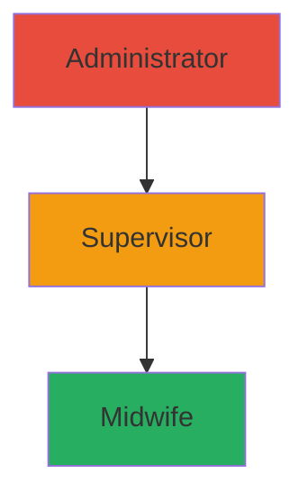

# MotivAid - User Roles & Permissions

## Role Hierarchy



---

## Role Definitions

### 1. Midwife (Primary User)
> Frontline healthcare worker using the app during deliveries

| Attribute | Value |
|-----------|-------|
| Role Code | `midwife` |
| Access Level | Standard |
| Facility Scope | Own facility only |

**Typical Users:**
- Midwives
- Nurses
- Community Health Workers (CHWs)
- Birth attendants

---

### 2. Supervisor (Secondary User)
> Facility-level oversight and quality assurance

| Attribute | Value |
|-----------|-------|
| Role Code | `supervisor` |
| Access Level | Elevated |
| Facility Scope | Own facility only |

**Typical Users:**
- Facility supervisors
- Senior midwives
- Maternal health coordinators

---

### 3. Administrator (System User)
> Program-level management and configuration

| Attribute | Value |
|-----------|-------|
| Role Code | `admin` |
| Access Level | Full |
| Facility Scope | All facilities |

**Typical Users:**
- App administrators
- Health program implementers
- IT support staff

---

## Permissions Matrix

| Feature | Midwife | Supervisor | Admin |
|---------|:-------:|:----------:|:-----:|
| **Authentication** |
| Login/Logout | ✅ | ✅ | ✅ |
| Reset own password | ✅ | ✅ | ✅ |
| Reset other passwords | ❌ | ❌ | ✅ |
| **Clinical Mode** |
| Activate clinical mode | ✅ | ✅ | ❌ |
| Enter maternal data | ✅ | ✅ | ❌ |
| Complete E-MOTIVE steps | ✅ | ✅ | ❌ |
| Trigger escalation | ✅ | ✅ | ❌ |
| View own cases | ✅ | ✅ | ❌ |
| **Training Mode** |
| Access training | ✅ | ✅ | ✅ |
| Take quizzes | ✅ | ✅ | ✅ |
| View own progress | ✅ | ✅ | ✅ |
| **Reports** |
| View own case reports | ✅ | ✅ | ❌ |
| View facility reports | ❌ | ✅ | ✅ |
| View all facilities | ❌ | ❌ | ✅ |
| Export reports | ❌ | ✅ | ✅ |
| **User Management** |
| View users | ❌ | ✅ | ✅ |
| Create users | ❌ | ❌ | ✅ |
| Edit users | ❌ | ❌ | ✅ |
| Assign roles | ❌ | ❌ | ✅ |
| **Settings** |
| Edit own profile | ✅ | ✅ | ✅ |
| Manage emergency contacts | ✅ | ✅ | ✅ |
| Configure facility | ❌ | ✅ | ✅ |
| System settings | ❌ | ❌ | ✅ |

---

## Role-Based Features

### Midwife Dashboard
```
┌─────────────────────────────────────────────┐
│  👋 Welcome, [Name]                         │
│  📍 [Facility Name]                         │
├─────────────────────────────────────────────┤
│  ┌─────────────┐  ┌─────────────┐          │
│  │  Clinical   │  │  Training   │          │
│  │    Mode     │  │    Mode     │          │
│  └─────────────┘  └─────────────┘          │
│                                              │
│  📊 Recent Cases                            │
│  ├─ Case #1234 - Today                      │
│  ├─ Case #1233 - Yesterday                  │
│  └─ Case #1232 - 2 days ago                 │
└─────────────────────────────────────────────┘
```

### Supervisor Dashboard
```
┌─────────────────────────────────────────────┐
│  👋 Welcome, [Name] (Supervisor)            │
│  📍 [Facility Name]                         │
├─────────────────────────────────────────────┤
│  ┌─────┐ ┌─────┐ ┌─────┐ ┌─────┐          │
│  │Cases│ │Staff│ │Audit│ │Train│          │
│  └─────┘ └─────┘ └─────┘ └─────┘          │
│                                              │
│  📈 This Week                               │
│  ├─ Cases: 15                               │
│  ├─ E-MOTIVE Adherence: 87%                 │
│  └─ Avg Response Time: 4.2 min              │
└─────────────────────────────────────────────┘
```

### Admin Dashboard
```
┌─────────────────────────────────────────────┐
│  👋 Administrator Panel                     │
├─────────────────────────────────────────────┤
│  ┌───────┐ ┌───────┐ ┌───────┐            │
│  │Users  │ │Facilit│ │Reports│            │
│  └───────┘ └───────┘ └───────┘            │
│  ┌───────┐ ┌───────┐ ┌───────┐            │
│  │Config │ │Logs   │ │Support│            │
│  └───────┘ └───────┘ └───────┘            │
│                                              │
│  🏥 Facilities: 24                          │
│  👥 Active Users: 156                       │
│  📋 Total Cases: 1,234                      │
└─────────────────────────────────────────────┘
```

---

## Database Implementation

### Users Table (Supabase)
```sql
CREATE TABLE users (
  id UUID PRIMARY KEY DEFAULT gen_random_uuid(),
  email TEXT UNIQUE NOT NULL,
  role TEXT NOT NULL CHECK (role IN ('midwife', 'supervisor', 'admin')),
  facility_id UUID REFERENCES facilities(id),
  full_name TEXT NOT NULL,
  phone TEXT,
  is_active BOOLEAN DEFAULT true,
  created_at TIMESTAMPTZ DEFAULT now(),
  updated_at TIMESTAMPTZ DEFAULT now()
);
```

### RLS Policies
```sql
-- Midwives see only their own data
CREATE POLICY "midwife_own_data" ON users
  FOR SELECT USING (auth.uid() = id);

-- Supervisors see users in their facility
CREATE POLICY "supervisor_facility_users" ON users
  FOR SELECT USING (
    EXISTS (
      SELECT 1 FROM users u 
      WHERE u.id = auth.uid() 
      AND u.role = 'supervisor' 
      AND u.facility_id = users.facility_id
    )
  );

-- Admins see all users
CREATE POLICY "admin_all_access" ON users
  FOR ALL USING (
    EXISTS (
      SELECT 1 FROM users WHERE id = auth.uid() AND role = 'admin'
    )
  );
```

---

## Flutter Implementation

### Role Enum
```dart
enum UserRole {
  midwife,
  supervisor,
  admin;

  bool get canAccessClinical => this == midwife || this == supervisor;
  bool get canViewFacilityReports => this == supervisor || this == admin;
  bool get canManageUsers => this == admin;
}
```

### Permission Check
```dart
extension RolePermissions on UserRole {
  bool hasPermission(Permission permission) {
    return _permissions[this]?.contains(permission) ?? false;
  }
}
```
